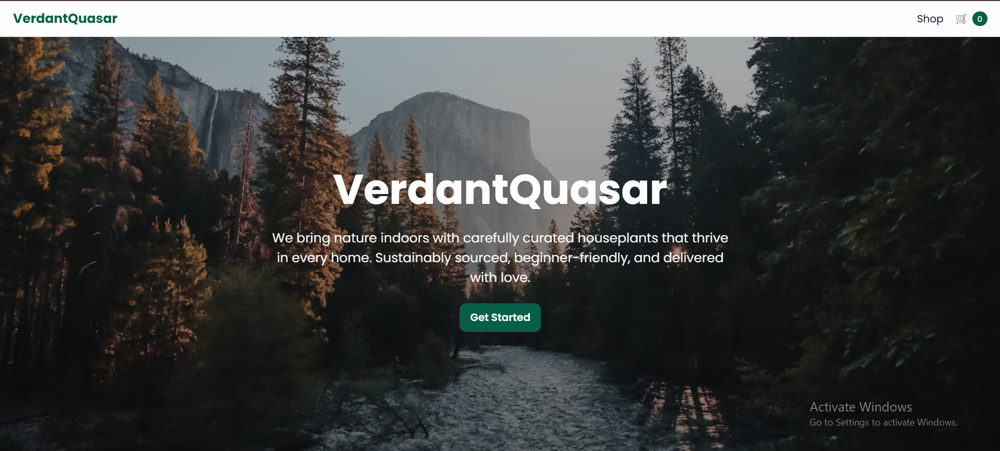
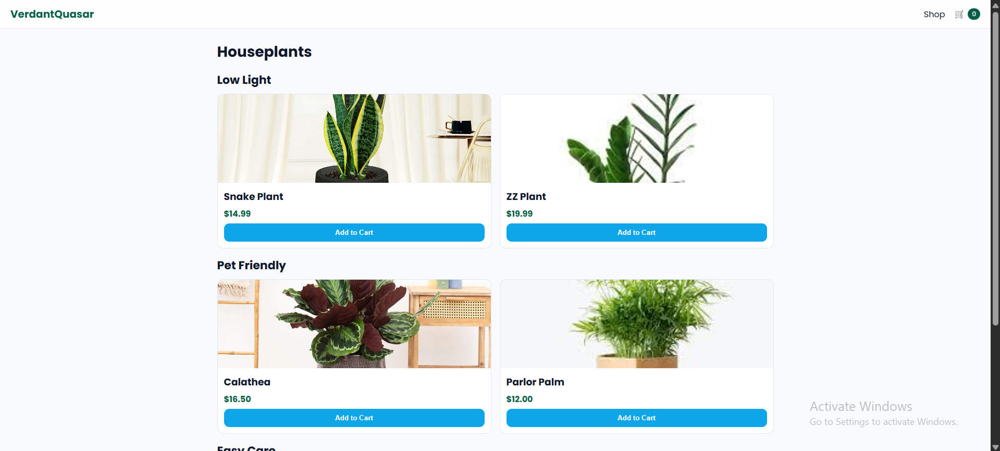
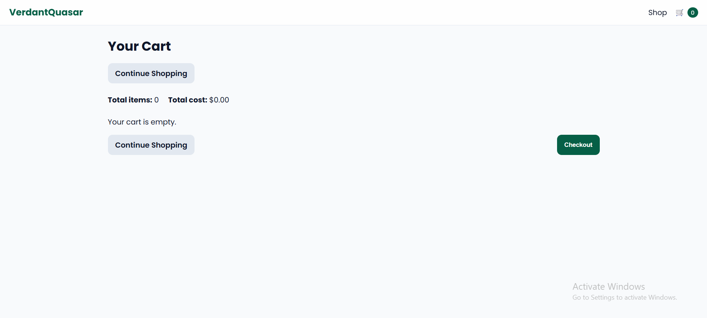

## plant-shop

A responsive 3-page online storefront created using plain HTML, CSS, and JavaScript. It features a homepage, a product catalog with category filters and an Add to Cart option, and a shopping cart page with quantity adjustments, total calculation, and basic navigation.

## Author
- Creator: Concepcion, Matrix T. 

## What's new (latest changes)
- The project structure was refined by categorizing assets into css/ and js/ directories to support organized GitHub deployment.
- Interactive hover effects were implemented to enhance user experience.
- Responsive layout optimizations were made for devices with 768px and 480px widths.
- A Redux-style store (js/store.js) was integrated, featuring action handlers (ADD_ITEM, INC, DEC, DEL) and persistent storage through localStorage.
- A “Continue Shopping” button was added to the cart page for improved usability.
  
## Pages
- Landing Page (index.html) – Features a background image, brand name, company description, and a “Get Started” button leading to the product listings.
- Product Page (products.html) – Displays six unique plants grouped into three categories, each showing a thumbnail, name, price, and an “Add to Cart” button.
- Cart Page (cart.html) – Lists all selected items with image, name, and price, plus options to increase, decrease, or delete items. Includes total quantity, total cost, a checkout alert, and “Continue Shopping” buttons at both the top and bottom.

## Features
- Shared header with cart icon and live count across pages.
- Add to Cart: increments count, disables button, persists to `localStorage`.
- Cart controls: increment/decrement/delete per item, recalculates totals.
- Responsive layout for mobile (768px and 480px breakpoints).
- Hover effects for product cards and buttons.

## Tech
- No frameworks; just static assets.
- State persistence via `localStorage` under key `verdantquasar_cart_v1`.
 - Redux-style store for state updates: `js/store.js`.

## Folder structure
```
  index.html
  products.html
  cart.html
  css/
    styles.css
  js/
    scripts.js
    store.js
  images/
    Assorted Succulent.avif
    Calathea.webp
    Golden Pothos.jpg
    Parlor Palm.jpg
    Snake Plant.jpg
    ZZ Plant.jpg
  README.md
```

## How to run locally
- Option 1: Open `index.html` directly in a browser.
- Option 2 (recommended for Chrome file:// restrictions): serve the folder with a simple server.
  - Python 3: `python -m http.server 8000` then visit `http://localhost:8000//index.html`.

## Screenshots (inline previews)
Place screenshots in `images/screenshots/` with these exact filenames so they render below in GitHub:

```
images/screenshots/
  landing.png
  products.png
  cart.png
```

Once added, previews will display here:

<div align="center">

<h4>Landing</h4>


<h4>Products</h4>


<h4>Cart</h4>


</div>

## Deploying to GitHub Pages
1. Push this folder to your GitHub repo.
2. In the repo settings, enable GitHub Pages for the `main` branch (root).
3. Access your Pages URL for `index.html` under your site.

## Customization
- Brand name is `VerdantQuasar` (change in all HTML titles/headers if you want).
- Images live in `images/`; product cards reference files by exact filename.
- To reset the cart, clear browser storage for this site or change `STORAGE_KEY` in `js/scripts.js`.

## Grading checklist mapping (for instructors)
- Landing page: background, paragraph, company name, CTA to products.
- Product listing: 6 unique plants, 3 categories, Add to Cart disables + increments + persists.
- Header: appears on products/cart, cart icon shows total items, nav between pages.
- Cart: total items, total cost, per-item thumbnail/name/unit price, increase/decrease/delete, checkout alert, continue shopping top and bottom.


